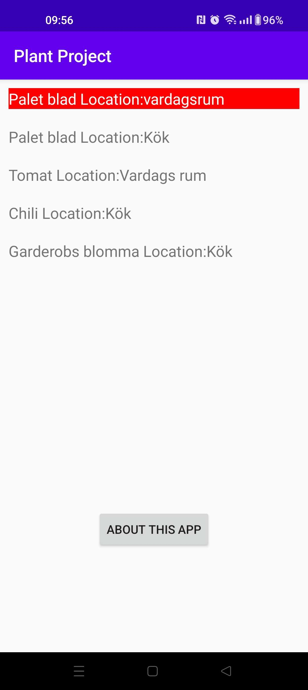
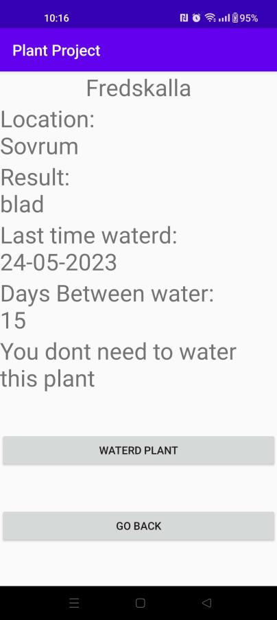

# Rapport

I denna uppgift används Recycler view för att visa information om plantor i min lägenhet. Main activity visar vilka plantor som behöver vattnas och har knappar för att kunna gå till about aktivity eller för att få mer information om plantorna. 
informationen genom ett JSON object som hämtas från "https://mobprog.webug.se/json-api?login=a22karja". Appen sparar denna information genom sharedpreference så att den inte behöver hämta infomationen varje gång den ska köras.

coded that handles button presses from activities other than main
```
@Override
    protected void onActivityResult(int requestCode, int resultCode, Intent data) {
        super.onActivityResult(requestCode, resultCode, data);
        Bundle extras = getIntent().getExtras();
        //Handle information from plant information page, here the data get updated incase someone presses that they waterd the plant
        if(requestCode==1)
        {
            if(resultCode==RESULT_OK)
            {
                String plantID=data.getStringExtra("KEY_NAME2");
                for (Plant p : Plants) {
                    if (p.getID().equals(plantID)) {
                        calender = Calendar.getInstance();
                        simpleDateFormat = new SimpleDateFormat("dd-MM-yyyy");
                        Time = simpleDateFormat.format(calender.getTime());
                        p.setCompany(Time);

                        myPreferenceEditor.clear();
                        Gson gson=new Gson();
                        String Pson=gson.toJson(Plants);
                        myPreferenceEditor.putString("MyAppPreferenceArray",Pson);
                        myPreferenceEditor.apply();

                        RecyclerView view = findViewById(R.id.view);
                        view.setLayoutManager(new LinearLayoutManager(this));
                        view.setAdapter(adapter);

                        break;
                    }
                }
            }
        }
        //Clear data if the user pressed the red button in ABOUT activity
        else if (requestCode==2) {
            if(resultCode==RESULT_OK)
            {
                myPreferenceEditor.clear();
                myPreferenceEditor.apply();
                finish();
                startActivity(getIntent());
            }
        }
    }
```

Recycler view som visar namn på plantor från sidan https://mobprog.webug.se/json-api?login=a22karja


Info sidan som visar mer information om plantan<br>


Video of app being installed and used
;

Fields from the json objekt and how they are used

ID = Just an ID<br>
Name = Name of Plant<br>
Company = When it was waterd last<br>
Location = Where the plant is<br>
Category = What the plant gives<br>
Cost = How often in days it should be watered<br>
