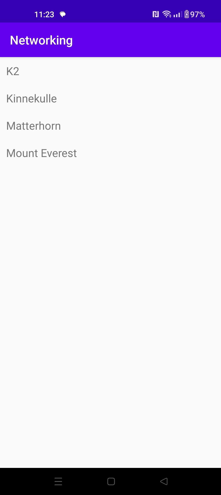

# Rapport

I denna uppgift används Recycler view för att visa data från en JSON fil som finns på nätet.
För recyclerview så finns 2 xml filer. activity_main.xml är till för att sätta in recyclerViewn
item.xml är för att beskriva hur de olika objekten ska se ut i recycler viewn. Här sä är de endast en text view vardera.

Sedan finns det 3 java filer som behövde redigeras i detta project.
Den första är MainActivity.java detta är vart appen körs. Där hämtas json data från hem sidan https://mobprog.webug.se/json-api?login=brom.
Sedan är det Mountain, detta är vad som beskriver objektet som RecyclerViewn håller i

MainActivity oncreate: fetches the data from JSON_URL and connects adapter to recyclerView. onPostExecute: puts data into adapter

```
    protected void onCreate(Bundle savedInstanceState) {
        super.onCreate(savedInstanceState);
        setContentView(R.layout.activity_main);

        //fetches json data from JSON_URL
        new JsonTask(this).execute(JSON_URL);
        //Initialize adapter so that it isnt null and is connectet to the ArrayList Mountains
        adapter = new RecyclerViewAdapter(this, Mountains, new RecyclerViewAdapter.OnClickListener() {
            @Override
            public void onClick(Mountain item) {
                Toast.makeText(MainActivity.this, item.getName(), Toast.LENGTH_SHORT).show();
            }
        });

        //Sets the recyclerView with ID view so it is connectet to adapter
        RecyclerView view = findViewById(R.id.view);
        view.setLayoutManager(new LinearLayoutManager(this));
        view.setAdapter(adapter);
    }
    
        @Override
    public void onPostExecute(String json) {

        Gson gson = new Gson();
        Type type = new TypeToken<ArrayList<Mountain>>() {}.getType();
        //Fetches the data in the string json so that it can be put into the ArrayList Mountains
        Mountains=gson.fromJson(json, type);
        Log.d("MainActivityB", Mountains.toString());
        //Updates the adapter data
        adapter.newData(Mountains);
        adapter.notifyDataSetChanged();
    }
```

Recycler view som visar berg på namn från sidan https://mobprog.webug.se/json-api?login=brom

